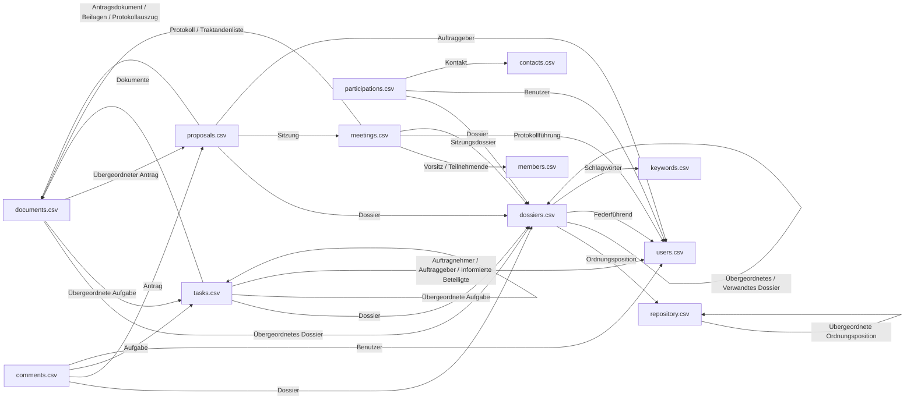

# Migrationskonzept: Export OneGov GEVER

Quelle: `2.2.2 Konzept Datenlieferung OneGov GEVER-v2-20260512_101839.docx`

Dieses Dokument beschreibt ausschliesslich die für den Export relevanten Inhaltstypen und deren Feld-Mappings.

## Allgemeines Exportformat

Der Export erfolgt je Inhaltstyp als strukturierte CSV-Datei. Die Spalte **Metadaten OneGov GEVER** definiert die Spaltenbezeichnung in der Exportdatei.

**Legende Typ:**
- `Text` – einfacher Textwert
- `Assoc` – referenzierter/verknüpfter Wert (Relation, oft mit zugehöriger UID-Spalte)
- `Datum` – Datumswert
- `Bool` – Boolean
- `-` – Lieferung/Feldtyp noch nicht definiert

Mehrwertige `Assoc`-Felder werden als Text mit `|` als Trennzeichen zwischen den Werten geliefert.

Referenziert eine `Assoc`-Spalte einen Datensatz aus einer anderen Export-Datei, wird der Dateiname (ohne Endung) dieser Datei an die Spaltenbezeichnung angehängt, getrennt durch ` -- `, damit die Zuordnung ohne Zusatzwissen aus der CSV ersichtlich ist. Beispiel: `Übergeordnetes Dossier - UID -- dossiers` referenziert einen Datensatz aus `dossiers.csv`.

### Referenzen zwischen den Export-Dateien

`keywords`, `members`, `users` und `contacts` sind reine Stammdaten-Exports ohne eigene ausgehende Referenzen (Blattknoten im Diagramm).

---

## Ordnungssystem

Es gibt bereits einen OS-Export-View: @@download_excel

Der CMI-Export bildet die gleichen Daten (Ordnungspositionen sortiert nach Ordnungspositionsnummer) eigenständig als CSV nach, anstatt den View direkt wiederzuverwenden - die Sharing-/Berechtigungsspalten des Views sind für den CMI-Export nicht relevant und werden nicht mitexportiert.

| Metadaten OneGov GEVER | Typ | Lieferung | Beispiel |
|---|---|---|---|
| Ordnungspositionsnummer | Text | Ordnungspositionsnummer als Text | 1.1 |
| Ordnungsposition UID | Text | UID der Ordnungsposition als Text | 2eb9f56139f740a0a312cd27a6382f6a |
| Pfad zum Objekt | Text | Physischer Pfad der Ordnungsposition als Text | ordnungssystem/politik-und-verwaltung |
| Übergeordnete Ordnungsposition - UID | Assoc | UID der übergeordneten Ordnungsposition als Text | 2eb9f56139f740a0a312cd27a6382f6a |
| Titel der Ordnungsposition | Text | Titel der Ordnungsposition als Text | Politik und Verwaltung |
| Titel der Ordnungsposition (französisch) | Text | Titel der Ordnungsposition (FR) als Text | Politique et administration |
| Titel der Ordnungsposition (englisch) | Text | Titel der Ordnungsposition (EN) als Text | Politics and administration |
| Beschreibung (optional) | Text | Beschreibung der Ordnungsposition als Text | Lorem Ipsum |
| Klassifikation | Assoc | Klassifikation der Ordnungsposition als Text | Nicht klassifiziert |
| Datenschutz | Assoc | Datenschutz der Ordnungsposition als Text | Nein |
| Öffentlichkeitsstatus | Assoc | Öffentlichkeitsstatus der Ordnungsposition als Text | Nicht geprüft |
| Aufbewahrungsdauer (Jahre) | Text | Aufbewahrungsdauer der Ordnungsposition als Text | 10 |
| Kommentar zur Aufbewahrungsdauer | Text | Kommentar zur Aufbewahrungsdauer als Text | Lorem Ipsum |
| Archivwürdigkeit | Assoc | Archivwürdigkeit der Ordnungsposition als Text | Ja |
| Kommentar zur Archivwürdigkeit | Text | Kommentar zur Archivwürdigkeit als Text | Lorem Ipsum |
| Archivische Schutzfrist (Jahre) | Text | Archivische Schutzfrist der Ordnungsposition als Text | 5 |
| Gültig ab | Datum | Gültig ab Datum der Ordnungsposition als Text | 01.01.2020 |
| Gültig bis | Datum | Gültig bis Datum der Ordnungsposition als Text | 31.12.2030 |

---

## Dossier

| Metadaten OneGov GEVER | Typ | Lieferung | Beispiel |
|---|---|---|---|
| Dossier UID | Text | UID des Dossiers als Text | 3eb9f56139f740a0a312cd27a6382f6b |
| Pfad zum Objekt | Text | Physischer Pfad des Dossiers als Text | ordnungssystem/politik-und-verwaltung/weisungen-organisation |
| Dossier-ID | Text | Dossier-ID des Dossiers als Text | 3263 |
| Status | Text| Status des Dossiers als Text | In Bearbeitung |
| Titel | Text | Titel des Dossiers als Text | Weisungen Organisation |
| Aktenzeichen Nr. | Assoc | Aktenzeichen des Dossiers als Text | 1.1 |
| Ordnungssystem - Ordnungsposition - UID | Assoc | UID der Ordnungsposition des Dossiers als Text | 2eb9f56139f740a0a312cd27a6382f6a |
| Übergeordnetes Dossier - UID | Assoc | Dossier UID des übergeordneten Dossiers | 2eb9f56139f740a0a312cd27a6382f6a |
| Beschreibung | Text | Beschreibung des Dossiers als Text | Lorem Ipsum |
| Federführend - Benutzer - UID | Assoc | Userid (Login) der federführenden Person als Text | friedli.rahel |
| Beginn | Datum | Beginn des Dossiers als Text | 27.08.2020 |
| Ende | Datum | Ende des Dossiers als Text | 27.08.2020 |
| Schlagwörter - UID | Assoc | UID aller Schlagwörter des Dossiers als Text (mehrere Werte mit `\|` getrennt) | 2eb9f56139f740d27a6382f6aa0a312c\|eb9f562139f740a7a6382f6a312cd20a\|9f7402eb9f56137a6382f6aa0a312cd2 |
| Verwandte Dossiers - Dossier - UID | Assoc | UID aller verwandten Dossiers als Text (mehrere Werte mit `\|` getrennt) | 2eb9f56139f740a0a312cd27a6382f6a\|2eb9f56139f740a0a312cd27a6382f6a |

---

## Dokumente

Dokumente, deren übergeordnete Aufgabe sich in einem abgeschlossenen Status befindet (z.B. abgebrochen oder geprüft und abgeschlossen), werden nicht exportiert - analog zu den Aufgaben selbst, von denen nur offene exportiert werden.

| Metadaten OneGov GEVER | Typ | Lieferung | Beispiel |
|---|---|---|---|
| Dokument UID | Text | UID des Dokuments als Text | 2eb9f566a9f740a0a31132cd27a6382f |
| Pfad zum Objekt | Text | Physischer Pfad des Dokuments als Text | ordnungssystem/politik-und-verwaltung/weisungen-organisation/protokollauszug-lorem-ipsum |
| Dokument-ID | Text | Dokument-ID des Dokuments als Text | 53482 |
| Übergeordnetes Dossier - UID | Assoc | Dossier UID des übergeordneten Dossiers) | 2eb9f566a9f740a0a31132cd27a6382d |
| Übergeordnete Aufgabe - UID | Assoc | Aufgaben UID der übergeordneten Aufgabe | 3eb9f566a9f740a0a31132cd27a6382d |
| Übergeordneter Antrag - UID | Assoc | Traktandum UID des übergeordneten Antrags | 9f740ab9f566a31132cd27a6382f0a2e |
| Titel | Text | Titel des Dokuments als Text | Lorem Ipsum |
| Dokumentennummer | Text | Dokumentennummer des Dokuments als Text | 6.3 / 40 / 53482 |
| Datei | Text | Dateiname des Dokuments als Text | Protokollauszug Lorem Ipsum.pdf |
| Dateipfad | Text | Relativer Pfad zur exportierten Blob-Datei als Text | documents/2eb9f566a9f740a0a31132cd27a6382f/Protokollauszug Lorem Ipsum.pdf |
| Beschreibung | Text | Text | Lorem Ipsum Dolor |
| Dokumentdatum | Datum | Dokumentdatum des Dokuments als Text | 27.08.2020 |
| Eingangsdatum | Datum | Eingangsdatum des Dokuments als Text | 27.08.2020 |
| Ausgangsdatum | Datum | Ausgangsdatum des Dokuments als Text | 27.08.2020 |
| Dokumenttyp | Assoc | Dokumenttyp des Dokuments als Text | Anfrage |
| Autor | Text | Autor des Dokuments als Text | Alex Roth |
| In Papierform aufbewahrt | Bool | In Papierform aufbewahrt des Dokuments als Text | Ja |

Die elektronischen Dokumente (Blobs) werden zusätzlich als Dateien geliefert:
- Pro Dokument ein Verzeichnis, benannt nach der Dokument-UID. Die Datei mit originalem Dateinamen

---

## Aufgaben

Der Export umfasst alle **offenen** Aufgaben.

| Metadaten OneGov GEVER | Typ | Lieferung | Beispiel |
|---|---|---|---|
| Aufgabe UID | Text | UID der Aufgabe als Text | 2eb9f566a9f740a0a31132cd27a6382f |
| Pfad zum Objekt | Text | Physischer Pfad der Aufgabe als Text | ordnungssystem/politik-und-verwaltung/weisungen-organisation/aufgabe-muster |
| Aufgabe-ID | Text | Aufgabe-ID der Aufgabe als Text | 53482 |
| Dossier - UID | Assoc | Dossier UID als Text | 0a312cd29f7402eb9f56137a6382f6aa |
| Übergeordnete Aufgabe - UID | Assoc | Aufgaben UID der übergeordneten Aufgabe | 3eb9f566a9f740a0a31132cd27a6382d |
| Status | Text | Status der Aufgabe als Text | In Bearbeitung |
| Titel | Text | Titel der Aufgabe als Text | Aufgabe Muster |
| Beschreibung | Text | Beschreibung der Aufgabe als Text | Lorem Ipsum |
| Zu Erledigen bis | Datum | Zu erledigen bis Datum der Aufgabe als Text | 25.03.2025 |
| Erinnerung | Datum | Erinnerung Datum der Aufgabe als Text | 25.03.2025 |
| Auftragnehmer - UID | Assoc | Userid (Login) des Auftragnehmers der Aufgabe als Text (ein Wert - Aufgaben haben einen einzelnen Responsible) | friedli.rahel |
| Auftraggeber - UID | Assoc | Userid (Login) des Auftraggebers der Aufgabe als Text (ein Wert - Aufgaben haben einen einzelnen Issuer) | friedli.rahel |
| Auftragstyp | Assoc | Auftragstyp Bezeichnung der Aufgabe als Text | Auftragtyp |
| Persönliche Aufgabe | Bool | Ja/Nein, ob die Aufgabe als persönliche Aufgabe markiert ist | Ja |
| Informierte Beteiligte - UID | Assoc | Userid (Login) Informierte Beteiligte der Aufgabe als Text (mehrere Werte mit `\|` getrennt) | friedli.rahel\|roth.alex |
| Dokumente - UID | Assoc | UID Dokumente der verknüpften Dokumente als Text (mehrere Werte mit `\|` getrennt) | 9f7402eb9f56137a6382f6aa0a312cd2\|0a312cd29f7402eb9f56137a6382f6aa |

---

## Schlagwörter

Der Export umfasst alle Schlagwörter. Wir führen keine UID. Wir generieren eine deterministische UID auf Basis des Titels.

| Metadaten OneGov GEVER | Typ | Lieferung | Beispiel |
|---|---|---|---|
| Schlagwort UID | Text | Deterministisch generierte UID auf Basis des Titels (kein natives Feld) | hash("Revision Organisationselement") |
| Schlagwort Bezeichnung | Text | Text | Revision Organisationselement |

---

## Kommentare

Der Export umfasst alle Kommentare auf Dossiers, offenen Aufgaben sowie Anträgen/Eingereichten Anträgen (Traktanden). Kommentare auf Dokumenten, Sitzungen oder abgeschlossenen/nicht mehr offenen Aufgaben werden nicht exportiert.

Ein Kommentar hat keine UID.

| Metadaten OneGov GEVER | Typ | Lieferung | Beispiel |
|---|---|---|---|
| Datum | Datum | Text | 25.02.2025 |
| Text | Text | Text | Lorem Ipsum |
| Dossier - UID | Assoc | Text | 3eb9f56139f740a0a312cd27a6382f6b |
| Antrag - UID | Assoc | Text | 3eb9f56139f740a0a312cd27a6382f6b |
| Aufgabe - UID | Assoc | Text | 3eb9f56139f740a0a312cd27a6382f6b |
| Benutzer - UID | Assoc | Userid (Login) als Text | friedli.rahel |

---

## Beteiligungen

Der Export umfasst alle Beteiligungen.

| Metadaten OneGov GEVER | Typ | Lieferung | Beispiel |
|---|---|---|---|
| Dossier - UID | Assoc | UID des Dossiers als Text | 9f566a402eba0a31132cd27a6382f9f7 |
| Benutzer - UID | Assoc | Userid (Login) des Benutzers der Beteiligung als Text | friedli.rahel |
| Kontakt - UID | Assoc | UID Kontakt der Beteiligung als Text | a402e566a0a31132cd27a6382f9f7b9f |
| Rollen | Assoc | Rollen der Beteiligung als Text (mehrere Werte mit `\|` getrennt) | Kenntnisnahme\|Mitwirkung\|Schlusszeichnung |

---

## Sitzungen

Der Export umfasst alle Sitzungen.

| Metadaten OneGov GEVER | Typ | Lieferung | Beispiel |
|---|---|---|---|
| Sitzung-ID | Text | ID der Sitzung als Text (nicht als UID, da Sitzungen kein natives UID-Feld haben) | 482 |
| Gremium | Text | Gremium der Sitzung als Text | Kirchgemeinderat |
| Sitzungstitel | Text | Sitzungstitel der Sitzung als Text | 20210217; Kirchgemeinderat - 2. Teil # KGR 2021 / 4 |
| Status | Text | Status der Sitzung als Text | Durchgeführt |
| Beginn | Datum / Uhrzeit | Beginn der Sitzung als Text | 17.02.2021 18:15 |
| Ende | Datum / Uhrzeit | Ende der Sitzung als Text | 17.02.2021 21:10 |
| Vorsitz - ID | Assoc | ID des Sitzungsmitglieds (Vorsitz) der Sitzung als Text | 12 |
| Protokollführung - UID | Assoc | Userid (Login) des Benutzers (Protokollführung) der Sitzung als Text | friedli.rahel |
| Ort | Text | Ort der Sitzung als Text | Cheminéezimmer Thomaskirche Liebefeld |
| Sitzungsdossier - UID | Assoc | UID Sitzungsdossier der Sitzung als Text | f566a2eb99f32cd27a6382f740a0a311 |
| Protokoll - UID | Assoc | UID des generierten Sitzungsprotokolls als Text | 0a312cda2eb9f4027a6382f6a59f7613 |
| Traktandenliste - UID | Assoc | UID der generierten Traktandenliste als Text | f7402eb9f56139a0acd26382f6a3127a |
| Teilnehmende - ID | Assoc | ID aller teilnehmenden Sitzungsmitglieder der Sitzung als Text (mehrere Werte mit `\|` getrennt) | 12\|34 |

---

## Sitzungsmitglieder

Der Export umfasst alle Sitzungsmitglieder. Sitzungsmitglieder haben kein natives UID-Feld, daher wird die numerische ID verwendet.

| Metadaten OneGov GEVER | Typ | Lieferung | Beispiel |
|---|---|---|---|
| Sitzungsmitglied-ID | Text | ID des Sitzungsmitglieds als Text | 12 |
| Vorname | Text | Vorname des Sitzungsmitglieds als Text | Andreas |
| Nachname | Text | Nachname des Sitzungsmitglieds als Text | Amstutz |
| E-Mail | Text | E-Mail des Sitzungsmitglieds als Text | andreas.amstutz@koeniz.ch |

---

## Traktanden (Anträge)

Der Export umfasst alle Traktanden (Anträge).

| Metadaten OneGov GEVER | Typ | Lieferung | Beispiel |
|---|---|---|---|
| Traktandum UID | Text | UID des Traktandums als Text | 9f740ab9f566a31132cd27a6382f0a2e |
| Pfad zum Objekt | Text | Physischer Pfad des Traktandums (Antrag bzw. Eingereichter Antrag) als Text | sitzungen/kirchgemeinderat/antrag-strategie-2026 |
| Traktandum Nr. | Text | Traktandum Nr. als Text | 1 |
| Beschlussnummer | Text | Beschlussnummer als Text | KGR 2021 / 18 |
| Titel | Text | Titel als Text | Festlegung Projektorganisation "Strategie 2026"; Genehmigung |
| Beschreibung | Text | Beschreibung als Text | Lorem Ipsum |
| Dossier - UID | Assoc | UID Dossier des Traktandums als Text | 9f740ab9f566a31132cd27a6382f0a2e |
| Sitzung - ID | Assoc | ID Sitzung als Text | 482 |
| Auftraggeber - UID | Assoc | Userid (Login) Antragssteller des Antrags als Text | friedli.rahel |
| Antragsdokument - UID | Assoc | UID Antragsdokument als Text | f7402eb9f56139a0acd26382f6a3127a |
| Status | Text | Status als Text | Beschlossen |
| Beilagen - UID | Assoc | UID aller Beilagen als Text (mehrere Werte mit `\|` getrennt) | 0a312cda2eb9f4027a6382f6a59f7613\|f7402eb9f56139a0acd26382f6a3127a |
| Entkoppelte Beilagen - UID | Assoc | UID aller entkoppelten Beilagen als Text (mehrere Werte mit `\|` getrennt) | 0a312cda2eb9f4027a6382f6a59f7613\|f7402eb9f56139a0acd26382f6a3127a |
| Protokollauszug - UID | Assoc | UID aller Protokollauszüge als Text (mehrere Werte mit `\|` getrennt) | 0a312cda2eb9f4027a6382f6a59f7613\|f7402eb9f56139a0acd26382f6a3127a |

---

## Benutzer

Der Export umfasst alle Benutzer. Benutzer haben kein natives UID-Feld, daher wird die Userid (Login) als "Benutzer UID" verwendet - dieser Wert wird auch in allen `Benutzer - UID`-Referenzspalten anderer Exportdateien verwendet (z.B. Dossier "Federführend", Aufgaben "Auftragnehmer"/"Auftraggeber"/"Informierte Beteiligte", Kommentare, Beteiligungen, Sitzungen "Protokollführung", Traktanden "Auftraggeber").

| Metadaten OneGov GEVER | Typ | Lieferung | Beispiel |
|---|---|---|---|
| Benutzer UID | Text | Userid (Login) des Benutzers als Text | friedli.rahel |
| Status | Assoc | Status des Benutzers als Text | Aktiv / Inaktiv |
| Name | Text | Name des Benutzers als Text | Roth |
| Vorname | Text | Vorname des Benutzers als Text | Alex |
| E-Mail | Text | E-Mail des Benutzers als Text | alex.roth@abraxas.ch |

---

## Kontakte

Der Export umfasst alle Kontakte.

| Metadaten OneGov GEVER | Typ | Lieferung | Beispiel |
|---|---|---|---|
| Kontakt UID | Text | UID des Kontakts als Text | 3eb9f56139f740a0a312cd27a6382f6b |
| Pfad zum Objekt | Text | Physischer Pfad des Kontakts als Text | kontakte/alex-roth |
| Anrede | Text | Anrede des Kontakts als Text | Herr |
| Titel | Text | Titel des Kontakts als Text | Dr. |
| Vorname | Text | Vorname des Kontakts als Text | Alex |
| Nachname | Text | Nachname des Kontakts als Text | Roth |
| Funktion | Text | Funktion des Kontakts als Text | Wirtschaftsinformatiker |
| Abteilung | Text | Abteilung des Kontakts als Text | GEVER |
| Firma | Text | Firma des Kontakts als Text | Abraxas Informatik AG |
| Telefon Arbeit | Text | Telefon des Kontakts als Text | 0791112233 |
| E-Mail 1 | Text | E-Mail 1 des Kontakts als Text | alex.roth@abraxas.ch |
| Telefon Mobile | Text | Telefon Mobile des Kontakts als Text | 0791234455 |
| E-Mail 2 | Text | E-Mail 2 des Kontakts als Text | alex@irgendwas.ch |
| Telefon Privat | Text | Telefon Privat des Kontakts als Text | 0791112233 |
| URL | Text | URL des Kontakts als Text | https://www.abraxas.ch |
| Fax Arbeit | Text | Fax Arbeit des Kontakts als Text | 0713334455 |
| Adresse (Strasse / Nr.) | Text | Adresse des Kontakts als Text | St. Leonhardstrasse 80 |
| Adresszusatz | Text | Adresszusatz des Kontakts als Text | Zusatz |
| PLZ | Text | PLZ des Kontakts als Text | 9001 |
| Ort | Text | Ort des Kontakts als Text | St.Gallen |
| Land | Text | Land des Kontakts als Text | Schweiz |
| Beschreibung | Text | Beschreibung des Kontakts als Text | Lorem Ipsum |

---

Umsetzung in src/opengever.maintenance/opengever.maintenance/scripts/export_gever_koeniz
